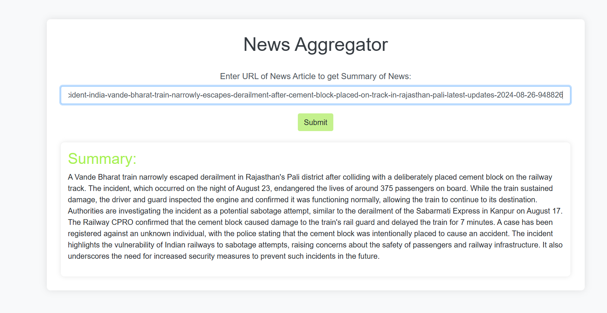

# News Aggregator Website

## Overview
This is a News Aggregator website built using Flask, which scrapes news articles from various sources and provides concise summaries. The scraping is handled by the Firecrawl SDK, and the news summaries are generated using Google Gemini.

## Features
- **Scrape News Articles:** Fetch news articles from various websites using their URLs.
- **Summarize Articles:** Automatically generate concise summaries of the articles using Google Gemini.
- **User-Friendly Interface:** A simple and intuitive web interface for users to input URLs and receive summarized news.

## Prerequisites
- Python 3.8+
- Flask
- Firecrawl SDK
- Google Gemini API

## Visuals

